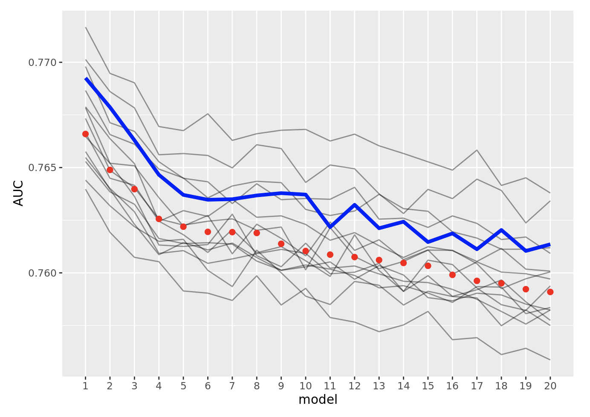
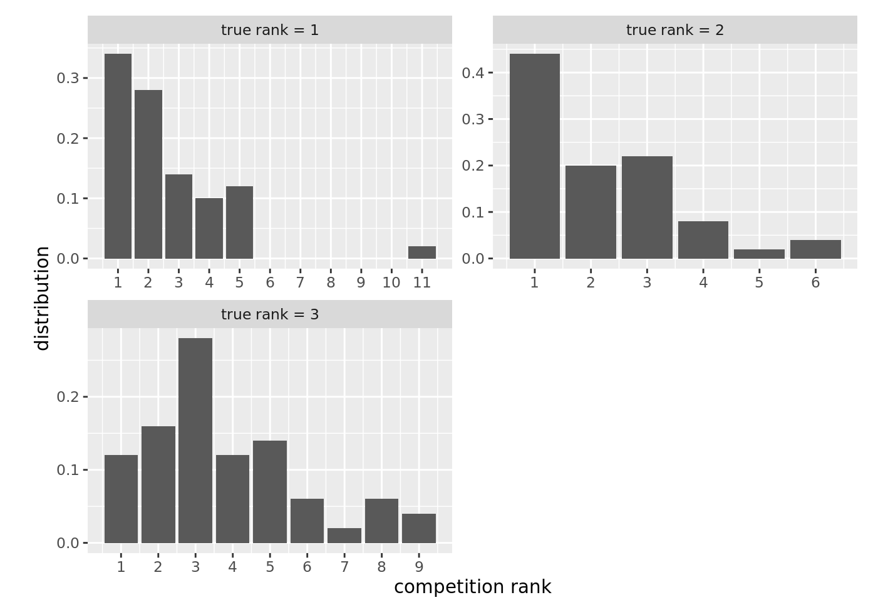
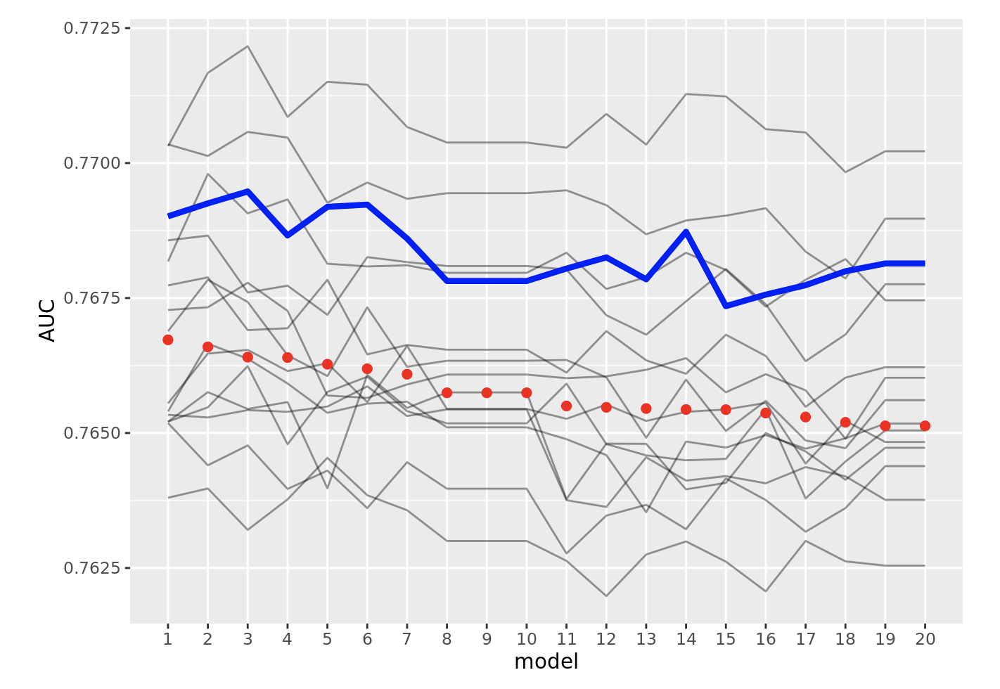
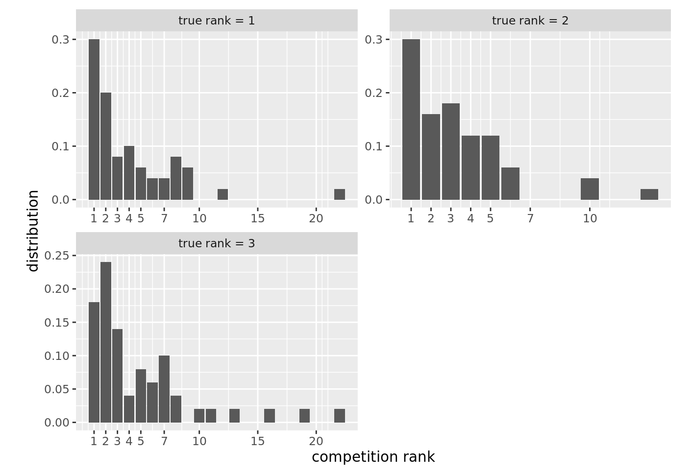
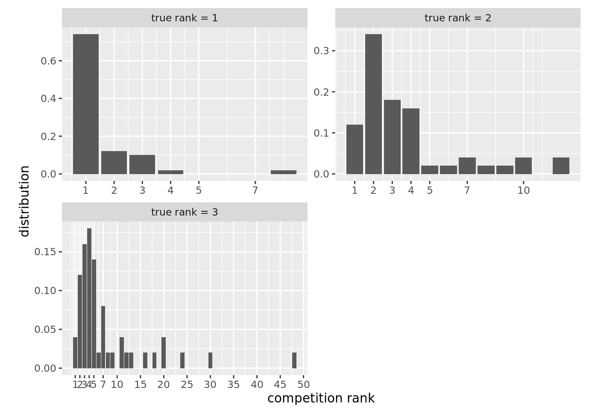
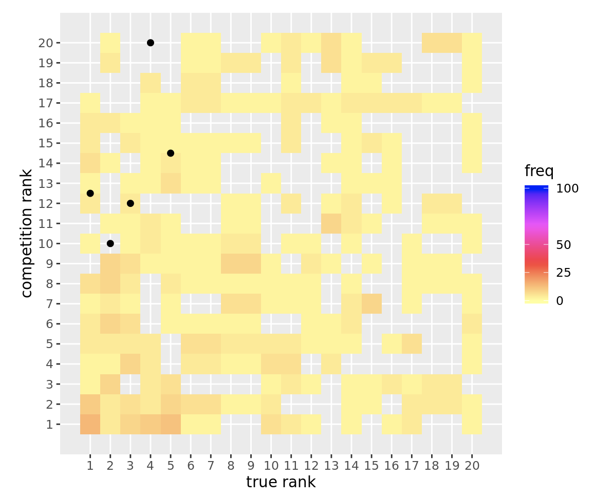

# Winner stability in data science competitions

Many data science competitions (e.g. Kaggles) are usually won with small, 4th digit (0.0001s) margins
in the respective metric over the 2nd place. If the dataset used for evaluation ("private 
leaderboard") is not large enough, the top ranks might not reflect true underlying value
(the ranks will have considerable statistical variation, i.e. a new evaluation dataset 
with the same characteristics could produce a totally different "winner"). 

In this repo we'll study the rank stability problem of the top models in a *simulation* of a data science competition 
as a function of the evaluation/test set size and the number of competitors. It is
to be expected that for a large number of competitors (lots of models within a small range of the
accuracy metric) and not large enough evaluation datasets, the "winner" will be to some extent random (among
the top models). 

This simple simulation captures an idealized setting. A training set (along with a separate "validation" set
used for early stopping) will be randomly drawn from a larger dataset.
A large "population" evaluation set will be drawn from the same data, and then we'll draw repeatedly
smaller (sub)samples from the latter to be used as "competition evaluation" set/"private leaderboard". 
We'll train several models on the training set and we'll compare their "true" performance and rank
(as measured on the larger "population" evaluation set) with the "competition" performance and rank
as measured on the smaller "private leaderboard" in each (re)sample. For a data science competition to be meaningful, the rank
of the top models in each "private leaderboard" resample should coincide with their rank on the
larger "population" evaluation set. 

Kaggle rankings in a competition are determined based on a single finite "private leaderboard" test set.
In the real world a larger "population" set is not available, however competition organizers could still evaluate
the stability/statistical significance of the top ranks using bootstrapping (from the "private 
leaderboard" test set). In fact, it was later found by this author that this bootstrapping procedure
has been already used long time ago in the KDD Cup 2004, and in one of its sub-competitions a 3-way tie
has been declared due to the statistical overlapping of the top models. In fact, the bootstrapping 
procedure could even be used as a "fair" way to distribute the prize money between the top competitors.

We have to note that this simple simulation only captures the effect of having a finite evaluation sample in presence of 
many competitors. In real-world projects, distributions (slowly) change in time and for example the
training and test sets have slightly different distribution. Also once models are deployed in production,
the data distributions change even further and it is not necessarily the best model on the evaluation test set
that is going to perform the best on the new online data. (For example it is a conjecture of this author that less
complex models will be more robust to non-stationarity and will perform better in practice than highly
tuned models that "win" a "competition" on a fixed test set).

## Simulation setup

From a dataset of 10 million records, we get a training sample of 100,000 and a validation set of 20,000 records. 
We train `M` (e.g. `M=1000`) GBM models (binary classification) with lightgbm by using random search over a grid of hyperparameter values
and early stopping on the validation set.
We measure the AUC of the models on a larger "population" evaluation set and on `C=50` samples of size `N` (e.g. `N=100,000`) 
simulating repeated "competitions" on finite "private leaderboard" test sets of size `N`. 
We rank the models (based on AUC) on the large "population" evaluation set ("true rank") and
also on each of the `C` "competitions" (on the "private leaderboards" test sets).

## Results

### "Private LB" test set size `N=100,000`

#### Number of models ("competitors") `M=100`

"True AUC" (as measured on the larger "population" evaluation set) vs "competition AUC" (as measured
on the "private LB" evaluation set on 4 resamples ("competitions"):

AUC paths for 10 resamples (red dots show population AUC, grey lines show AUC for the 10 "competitions", blue line 
shows one specific competition for easier understanding)

Zooming into the top 20 models:

"True ranks" (as measured on the larger "population" evaluation set) vs "competition ranks" (as measured
on the "private LB" evaluation 

It is clear that in this case the top 3 ranks remain pretty stable (the top 3 models
rarely switch ranks as it can be seen on all the above plots). As we go down in the ranks, the rank
stability decreases, e.g. the 90% confidence interval for the "competition rank" of the 10th model is
[6,16], for the 30th model is [21,46]

#### Number of models ("competitors") `M=1000`

When the number of competitors increases, the top ranks become more unstable:

#### Number of models `M=3000`

It is very common in Kaggle competitions to have ~3000 participants. In this case: 

### "Private LB" test set size `N=10,000`

For smaller evaluation sets (sadly actually pretty common in Kaggle competitions), the noise increases and the ranks are
(even) more unstable. 

#### Number of models `M=100`

#### Number of models `M=3000`

Running such a competition is silly. The median "competition rank" for the actually best model is 12, that is there is
50% chance that the best model will be 12th or worse in the competition. There is even a 10% chance that the best model will be ranked
50th or worse. 

